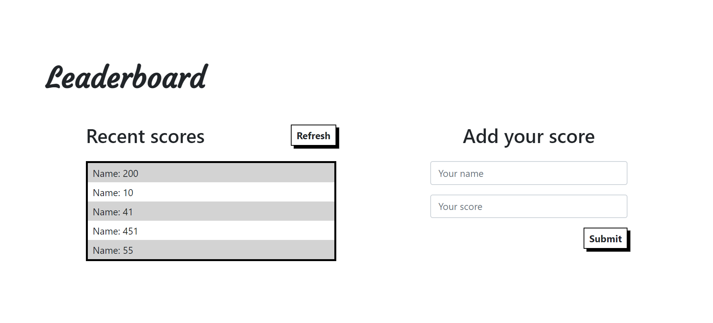

# Project Name

> The leaderboard project calls an API through fetch and callback functions.

## Built With

- Webpacks
- HTML & CSS
- JavaScript
- Bootstrap 5

## Live Demo

[Live Demo Link](https://shadyshawkat.github.io/Leaderboard/dist)

## Getting Started

To get a local copy up and running follow these simple example steps.

1- Navigate to the button on the top right green "code" button.

2- In the drop down menu choose "Download Zip" or clone it using git using the following command.
~~~bash
$ git clone git@github.com:ShadyShawkat/Leaderboard.git
~~~
3- After extracting the files, you'll have my project on your local machine.

4- to run the project you'll need to use the following command in your terminal to set up the node modules.
~~~bash
$ npm i
~~~

## Authors

👤 **Shady Shawkat**

- GitHub: [@shadyshawkat](https://github.com/ShadyShawkat)
- Twitter: [@shadyshawkat](https://twitter.com/ShadyShawkat3)
- LinkedIn: [shadyshawkat](https://www.linkedin.com/in/shady-shawkat/)

## 🤝 Contributing

Contributions, issues, and feature requests are welcome!

Feel free to check the [issues page](../../issues/).

## Show your support

Give a ⭐️ if you like this project!

## Acknowledgments

- Hat tip to anyone whose code was used
- Inspiration
- etc

## 📝 License

This project is [MIT](./MIT.md) licensed.